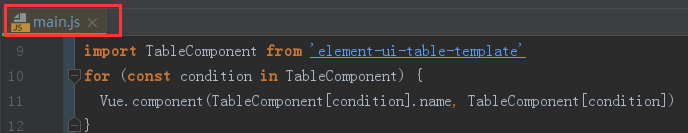

## a table component based on element-ui

### install
```
npm install element-ui-table-template
```
### use

```
/*main.js中引入*/
import TableComponent from 'element-ui-table-template'
/*全局注册*/
for (const condition in TableComponent) {
  Vue.component(TableComponent[condition].name, TableComponent[condition])
}
/*或者*/
/*Vue.component('TableLayout', TableComponent.TableLayout)
Vue.component('TableTemplate', TableComponent.TableTemplate)*/
```
### use in page
+ 1引入mixins.js
+ 2定义表头
+ 3...
### mixins.js
```
export const Mixins = {
  data() {
    return {
      pageObj: { page: 1, limit: 10, total: 0 },
      queryParams: {},
      tableData: []
    }
  },
  mounted() {
    this.init()
  },
  methods: {
    init() {
      console.log('这是混入的初始化方法')
      this.getTableData()
    },
    // 查询按钮
    search() {
      this.pageObj.page = 1
      this.init()
    },
    // 分页长度改变
    handleSizeChange(val) {
      this.pageObj.limit = val
      this.init()
    },
    // 分页页码改变
    handleCurrentChange(val) {
      this.pageObj.page = val
      this.init()
    },
    getQueryParams() {
      const queryParams = { ...this.queryParams, ...this.pageObj }
      delete queryParams['total']
      return queryParams
    }
  }
}

```
### page example
```
<!--suppress ALL -->
<template>
  <!--table模板-->
  <table-layout :span-method="spanMethod" :page-obj="pageObj" :headers="headers" :table-data="tableData" @sizeChange="handleSizeChange" @currentChange="handleCurrentChange" @handleRowClick="handleRowClick" @handleCellClick="handleCellClick" @selectionChange="handleSelectionChange">
    <template slot="top-left">
      左边插槽
    </template>
    <template slot="top-right">
      右边插槽
    </template>
    <!---->
    <template slot="expand" slot-scope="{scope}">
      <el-form label-position="left" inline class="demo-table-expand">
        <el-form-item label="名称">
          {{ scope.row.name }}
        </el-form-item>
      </el-form>
    </template>
    <!--姓名电话-->
    <template slot="name-phone" slot-scope="{scope}">
      <div> <i class="el-icon-time"/>{{ scope.row.name }}</div>
      <div> <i class="el-icon-time"/>{{ scope.row.phone }}</div>
    </template>
    <!--头像-->
    <template slot="avatar" slot-scope="{scope}">
      
    </template>
    <!--操作-->
    <template slot="operator" slot-scope="{scope}">
      <el-button @click="handleView(scope.row)">查看</el-button>
      <el-button @click="handleDel(scope.row)">删除</el-button>
    </template>
  </table-layout>
</template>

<script>
import { Mixins } from './../../mixins/table_mixins'
export default {
  name: 'Table2',
  mixins: [Mixins],
  data() {
    return {
      headers: [
        { type: 'selection' },
        { type: 'expand', slot: 'expand' },
        { type: 'index', fixed: true },
        { prop: 'id', label: 'id' },
        { prop: 'name', label: '姓名', slot: 'name-phone' },
        { prop: 'loginName', label: '登录名' },
        { prop: 'nickName', label: '昵称' },
        { prop: 'avatar', label: '头像', width: 300, slot: 'avatar' },
        { prop: 'age', label: '年龄' },
        { prop: 'status', label: '状态' },
        { prop: 'acorpName', label: '公司名称' },
        { prop: 'departmentName', label: '部门名称' },
        { prop: 'description', label: '描述' },
        { prop: 'time',
          label: '时间',
          children: [
            { prop: 'createTime',
              label: '创建时间',
              children: [
                { prop: 'createTime', label: '创建时间' },
                { prop: 'updateTime', label: '更新时间' }
              ] },
            { prop: 'updateTime', label: '更新时间' }
          ] },
        { label: '操作', slot: 'operator', fixed: 'right', width: 180 }
      ],
      queryParams: {
        keyword: ''
      }
    }
  },
  created() {
    this.queryParams.keyword = 'keyword'
  },
  methods: {
    init() {
      console.log('init方法做一些其它事情')
      this.getTableData()
    },
    getQueryParams() {
      console.log('重写getQueryParams')
      const queryParams = { ...this.queryParams, ...this.pageObj }
      delete queryParams['total']
      return queryParams
    },
    spanMethod({ row, column, rowIndex, columnIndex }) {
      if (columnIndex === 2) {
        if (rowIndex % 2 === 0) {
          return {
            rowspan: 2,
            colspan: 1
          }
        } else {
          return {
            rowspan: 0,
            colspan: 0
          }
        }
      }
    },
    handleView(obj) {
      console.log('查看对象:%o', obj)
    },
    handleDel(obj) {
      console.log('删除对象:%o', obj)
    },
    getTableData() {
      const page = this.pageObj.page
      const limit = this.pageObj.limit
      this.pageObj.total = 100
      this.tableData = []
      for (let i = 0; i < limit; i++) {
        this.tableData.push({ id: page * limit + i, name: '测试' + page * limit + i })
      }
    },
    handleSelectionChange(val) {
      console.log(val)
    },
    handleRowClick(row, event, column) {
      console.log('点击行对象:%o', row)
    },
    handleCellClick(row, column, cell, event) {
      console.log('点击单元格对象:%o', cell)
    }
  }
}
</script>

```

### 文档
参考element-ui 表格主键
Table Attributes大致相同，
Table-column Attributes需转化为header对象

